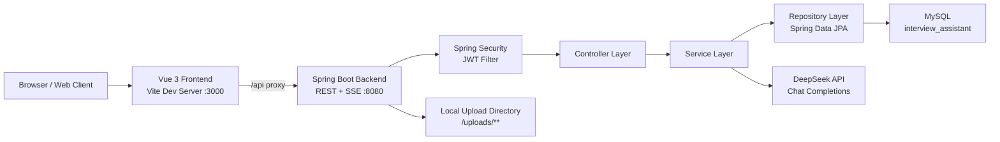

# Interview Assistant

面向计算机相关岗位的 AI 面试助手系统，提供用户认证、AI 对话、模拟技术面试、简历生成、简历 PDF 导出、面试历史复盘等能力。项目采用前后端分离架构：前端基于 Vue 3 + Vite + Element Plus，后端基于 Spring Boot 3 + Spring Security + JPA + MySQL，并通过 DeepSeek 兼容的 Chat Completions API 提供大模型能力。

## 目录

- [项目概览](#项目概览)
- [核心功能](#核心功能)
- [系统架构](#系统架构)
- [前端架构](#前端架构)
- [后端架构](#后端架构)
- [数据架构](#数据架构)
- [接口概览](#接口概览)
- [本地开发](#本地开发)
- [环境变量](#环境变量)
- [构建与部署](#构建与部署)
- [安全设计](#安全设计)
- [测试与质量](#测试与质量)
- [目录结构](#目录结构)
- [运维建议](#运维建议)

## 项目概览

| 项目项 | 说明 |
| --- | --- |
| 项目名称 | Interview Assistant |
| 项目类型 | AI 面试辅助 Web 应用 |
| 架构模式 | 前后端分离、REST + SSE、JWT 无状态认证 |
| 前端端口 | `3000` |
| 后端端口 | `8080` |
| 数据库 | MySQL `interview_assistant` |
| AI 服务 | DeepSeek Chat Completions API |
| 健康检查 | `/actuator/health` |
| 主要用户 | 计算机专业学生、求职者、面试训练平台运营方 |

## 核心功能

- 用户注册、登录、JWT 鉴权、用户资料维护。
- AI 对话助手，支持会话创建、历史消息查询、会话删除、流式回复。
- 模拟技术面试，支持岗位输入、AI 生成题目、逐题作答、主动终止、最终评分和学习建议。
- 简历生成，基于用户输入生成结构化 Markdown 简历内容。
- 简历头像上传，并通过 `/uploads/**` 提供静态资源访问。
- 简历 PDF 下载，后端基于 OpenPDF 生成文件流。
- 面试历史查询，支持查看面试场次、题目、答案、评分、参考答案和复盘建议。

## 系统架构



### 架构特点

- 前端通过统一 Axios 实例访问 `/api`，开发环境由 Vite 代理到后端。
- AI 长文本输出使用 SSE 流式传输，提升聊天和面试交互体验。
- 后端采用 Controller、Service、Repository 分层，业务逻辑集中在 Service。
- 用户身份通过 JWT 在请求头 `Authorization: Bearer <token>` 中传递。
- 生产环境通过环境变量注入数据库、JWT、AI Key、跨域白名单和上传路径。
- 后端通过 Actuator 暴露健康检查，并通过 `X-Request-Id` 支持请求链路追踪。

## 前端架构

### 技术栈

| 类别 | 技术 |
| --- | --- |
| 框架 | Vue 3 |
| 构建工具 | Vite 5 |
| UI 组件 | Element Plus、@element-plus/icons-vue |
| 路由 | Vue Router 4 |
| HTTP | Axios、Fetch |
| Markdown | marked |
| 内容安全 | DOMPurify |

### 路由设计

| 路由 | 页面 | 鉴权 | 说明 |
| --- | --- | --- | --- |
| `/` | 重定向 | 是 | 默认跳转 `/chat` |
| `/login` | 登录/注册 | 否 | 认证入口 |
| `/chat` | AI 对话 | 是 | 主聊天工作台 |
| `/account` | 账号中心 | 是 | 用户资料维护 |
| `/resume` | 简历生成 | 是 | 简历生成、历史、下载 |
| `/interview` | 模拟面试 | 是 | 岗位面试、答题、复盘 |

### 前端分层

```text
frontend/src
├── api             # API 封装，统一鉴权、错误处理、SSE 请求
├── router          # 路由定义和登录态守卫
├── views           # 页面级组件
├── App.vue         # 应用壳
└── main.js         # Vue 应用入口
```

### 请求机制

- `src/api/request.js` 创建 Axios 实例，默认 `baseURL=/api`。
- 请求拦截器从 `localStorage` 读取 `token` 并注入 `Authorization` 头。
- 响应拦截器统一处理业务码、`401` 重新登录、`429` 限流提示和网络错误。
- 聊天与面试的流式输出使用原生 `fetch` 读取 `ReadableStream`，解析 `event:` 和 `data:` SSE 行。

## 后端架构

### 技术栈

| 类别 | 技术 |
| --- | --- |
| 语言 | Java 17 |
| 框架 | Spring Boot 3.2.5 |
| Web | Spring MVC、Spring WebFlux WebClient |
| 安全 | Spring Security、JWT、BCrypt |
| 数据访问 | Spring Data JPA、Hibernate |
| 数据库 | MySQL |
| AI 调用 | WebClient + DeepSeek API |
| PDF | OpenPDF |
| 测试 | JUnit、Spring Boot Test |

### 后端分层

```text
backend/src/main/java/com/interviewassistant
├── ai              # DeepSeek 请求、响应、流式分片模型
├── common          # 统一返回、业务异常、限流异常、全局异常处理
├── config          # Security、CORS、静态资源映射
├── controller      # REST/SSE 接口入口
├── dto             # 请求/响应 DTO
├── entity          # JPA 实体
├── repository      # Spring Data JPA Repository
├── security        # JWT 生成、解析、认证过滤器
├── service         # 服务接口
└── service/impl    # 业务实现
```

### 核心后端模块

| 模块 | 主要类 | 说明 |
| --- | --- | --- |
| 认证 | `AuthController`、`AuthServiceImpl`、`JwtTokenProvider` | 注册、登录、JWT 签发与校验 |
| 用户 | `UserController`、`UserServiceImpl` | 用户资料查询和更新 |
| 聊天 | `ChatController`、`ChatServiceImpl` | AI 流式对话、会话管理、每日提问限制 |
| 面试 | `InterviewController`、`InterviewServiceImpl` | 生成题目、保存答案、AI 评分、面试复盘 |
| 简历 | `ResumeController`、`ResumeServiceImpl`、`PdfServiceImpl` | 简历生成、历史查询、PDF 导出、图片上传 |
| AI | `AIServiceImpl` | 统一封装 DeepSeek 普通响应与流式响应 |
| 安全 | `SecurityConfig`、`JwtAuthenticationFilter` | 无状态认证、接口权限、异常响应 |
| 异常 | `GlobalExceptionHandler` | 参数错误、业务异常、限流、AI 异常、权限异常统一处理 |

## 数据架构

数据库脚本位于 `backend/database/schema.sql`，默认数据库名为 `interview_assistant`。

| 表 | 说明 |
| --- | --- |
| `users` | 用户账号、密码、邮箱、头像、创建和更新时间 |
| `conversations` | AI 聊天会话，按用户归属 |
| `chat_messages` | 聊天消息，区分 `user` 与 `assistant` |
| `interview_sessions` | 模拟面试场次、岗位、状态、总分、总评、学习建议 |
| `interview_questions` | 面试题目、用户答案、单题评分、点评、参考答案 |
| `resumes` | 简历输入信息、头像、目标岗位、AI 生成内容 |

### 主要关系

- `users 1:N conversations`
- `users 1:N chat_messages`
- `conversations 1:N chat_messages`
- `users 1:N interview_sessions`
- `interview_sessions 1:N interview_questions`
- `users 1:N resumes`

## 接口概览

后端所有业务接口统一以 `/api` 开头，除认证接口外均需要 JWT。

### 认证接口

| 方法 | 路径 | 说明 |
| --- | --- | --- |
| `POST` | `/api/auth/register` | 用户注册 |
| `POST` | `/api/auth/login` | 用户登录并返回 JWT |

### 用户接口

| 方法 | 路径 | 说明 |
| --- | --- | --- |
| `GET` | `/api/user/profile` | 获取当前用户资料 |
| `PUT` | `/api/user/profile` | 更新当前用户资料 |

### 聊天接口

| 方法 | 路径 | 说明 |
| --- | --- | --- |
| `POST` | `/api/chat` | 发送消息并通过 SSE 返回 AI 回复 |
| `POST` | `/api/conversations` | 创建会话 |
| `GET` | `/api/conversations` | 获取会话列表 |
| `GET` | `/api/conversations/{id}/messages` | 获取会话消息 |
| `DELETE` | `/api/conversations/{id}` | 删除会话 |

聊天 SSE 事件：

| 事件 | 说明 |
| --- | --- |
| `user_message` | 用户消息保存成功 |
| `token` | AI 回复分片 |
| `done` | AI 回复完成并保存 |
| `error` | 流式处理异常 |

### 面试接口

| 方法 | 路径 | 说明 |
| --- | --- | --- |
| `POST` | `/api/interview/start` | 开始模拟面试，生成开场白和题目 |
| `POST` | `/api/interview/answer` | 提交当前题答案 |
| `POST` | `/api/interview/terminate` | 主动终止面试 |
| `GET` | `/api/interview/sessions` | 获取面试历史 |
| `GET` | `/api/interview/sessions/{id}` | 获取面试详情 |

面试 SSE 事件：

| 事件 | 说明 |
| --- | --- |
| `greeting` | AI 面试官开场白 |
| `session_created` | 面试会话创建成功 |
| `question` | 当前或下一道面试题 |
| `answer_saved` | 答案已保存 |
| `evaluating` | 正在生成最终评价 |
| `final_evaluation` | 总分、总评、学习建议和单题评价 |
| `terminated` | 面试已终止 |
| `error` | 面试流程异常 |

### 简历接口

| 方法 | 路径 | 说明 |
| --- | --- | --- |
| `POST` | `/api/resume/generate` | AI 生成简历 |
| `GET` | `/api/resume/history` | 获取简历历史 |
| `GET` | `/api/resume/{id}/pdf` | 下载简历 PDF |
| `POST` | `/api/resume/upload-photo` | 上传头像/照片 |

### 响应格式

普通 REST 接口统一返回：

```json
{
  "code": 200,
  "message": "success",
  "data": {}
}
```

## 本地开发

### 基础依赖

- JDK 17 或以上。
- Node.js 18 或以上。
- MySQL 8 或兼容版本。
- DeepSeek API Key。

项目内提供 `backend/mvn-local.cmd`，会使用 `.tools/apache-maven-3.9.9` 和 `.tools/m2` 作为本地 Maven 环境与仓库。

### 1. 初始化数据库

```cmd
cd backend\database
init-db.cmd
```

默认数据库连接：

| 配置 | 默认值 |
| --- | --- |
| Host | `localhost` |
| Port | `3306` |
| Database | `interview_assistant` |
| Username | `root` |
| Password | `root` |

### 2. 启动后端

```cmd
cd backend
set DEEPSEEK_API_KEY=your_deepseek_api_key
mvn-local.cmd spring-boot:run
```

后端默认运行在：

```text
http://localhost:8080
```

### 3. 启动前端

```cmd
cd frontend
npm ci
npm run dev
```

前端默认运行在：

```text
http://localhost:3000
```

开发环境下，Vite 会将 `/api` 请求代理到 `http://localhost:8080`。前端配置模板位于 `frontend/.env.example`，可复制为 `.env.local` 后按环境调整。

## 环境变量

### 后端环境变量

| 变量 | 默认值 | 说明 |
| --- | --- | --- |
| `SERVER_PORT` | `8080` | 后端服务端口 |
| `SPRING_PROFILES_ACTIVE` | `dev` | 运行环境，支持 `dev`、`prod` |
| `DB_URL` | 本地 MySQL 地址 | JDBC 连接串 |
| `DB_USERNAME` | `root` | 数据库用户名 |
| `DB_PASSWORD` | `root` | 数据库密码 |
| `JWT_SECRET` | 内置开发密钥 | JWT 签名密钥，生产必须替换 |
| `JWT_EXPIRATION` | `86400000` | JWT 有效期，单位毫秒 |
| `DEEPSEEK_API_KEY` | 空 | DeepSeek API Key，必填 |
| `DEEPSEEK_API_URL` | `https://api.deepseek.com/chat/completions` | AI 接口地址 |
| `DEEPSEEK_MODEL` | `deepseek-v4-pro` | 默认模型名 |
| `DEEPSEEK_TIMEOUT` | `60000` | AI 调用超时时间，单位毫秒 |
| `CORS_ALLOWED_ORIGIN_PATTERNS` | `http://localhost:3000,http://localhost:5173` | 允许跨域来源 |
| `UPLOAD_PATH` | `uploads` | 上传文件存储目录 |
| `MAX_FILE_SIZE` | `5MB` | 单文件上传大小限制 |
| `MAX_REQUEST_SIZE` | `10MB` | 上传请求大小限制 |
| `INTERVIEW_DEFAULT_QUESTION_COUNT` | `5` | 默认面试题数量 |
| `INTERVIEW_MAX_QUESTION_COUNT` | `10` | 最大面试题数量配置 |

根目录提供 `.env.example` 作为后端运行变量模板。

### 生产环境示例

```cmd
set SPRING_PROFILES_ACTIVE=prod
set DB_URL=jdbc:mysql://your-db-host:3306/interview_assistant?useUnicode=true&characterEncoding=utf-8&serverTimezone=Asia/Shanghai
set DB_USERNAME=your_db_user
set DB_PASSWORD=your_db_password
set JWT_SECRET=replace-with-a-random-secret-at-least-32-bytes-long
set DEEPSEEK_API_KEY=your_deepseek_api_key
set CORS_ALLOWED_ORIGIN_PATTERNS=https://your-domain.com
set UPLOAD_PATH=C:\srv\interview-assistant\uploads
```

## 构建与部署

### 后端构建

```cmd
cd backend
mvn-local.cmd clean package
```

构建产物：

```text
backend/target/interview-assistant-1.0.0.jar
```

运行：

```cmd
java -jar backend\target\interview-assistant-1.0.0.jar
```

### 前端构建

```cmd
cd frontend
npm ci
npm run build
```

构建产物：

```text
frontend/dist
```

### Nginx 反向代理建议

前端使用 History 路由，生产部署时需要将页面路由回退到 `index.html`，并将 `/api/` 转发到后端。

```nginx
server {
    listen 80;
    server_name your-domain.com;

    root /srv/interview-assistant/frontend/dist;
    index index.html;

    location / {
        try_files $uri $uri/ /index.html;
    }

    location /api/ {
        proxy_pass http://127.0.0.1:8080/api/;
        proxy_http_version 1.1;
        proxy_set_header Host $host;
        proxy_set_header X-Real-IP $remote_addr;
        proxy_set_header X-Forwarded-For $proxy_add_x_forwarded_for;
        proxy_set_header X-Forwarded-Proto $scheme;
        proxy_read_timeout 180s;
    }

    location /uploads/ {
        proxy_pass http://127.0.0.1:8080/uploads/;
        proxy_http_version 1.1;
        proxy_set_header Host $host;
    }
}
```

## 安全设计

- JWT 无状态认证：后端不保存 Session，便于水平扩展。
- BCrypt 密码哈希：用户密码不以明文保存。
- 路由权限控制：`/api/auth/**`、`/uploads/**`、`/actuator/health` 和 `/actuator/info` 公开，其余接口默认需要登录。
- 前端路由守卫：无 token 访问受保护页面时跳转登录页。
- 全局异常处理：统一返回认证、授权、限流、AI 服务和系统异常。
- CORS 白名单：通过环境变量限制允许访问的前端域名。
- 资源隔离：上传文件由 `UPLOAD_PATH` 管理，并通过 `/uploads/**` 暴露。
- 请求追踪：后端响应 `X-Request-Id`，日志中携带 requestId，方便跨服务排障。

生产环境必须完成以下安全配置：

- 替换默认 `JWT_SECRET`，长度建议不少于 32 字节。
- 使用专用数据库账号，避免使用 `root`。
- 为站点启用 HTTPS。
- 将 `SPRING_PROFILES_ACTIVE` 设置为 `prod`。
- 严格配置 `CORS_ALLOWED_ORIGIN_PATTERNS`。
- 对上传文件增加格式、大小、内容安全扫描等策略。

## 测试与质量

### 后端测试

当前后端已有 JUnit 测试目录：

```text
backend/src/test/java
```

运行：

```cmd
cd backend
mvn-local.cmd test
```

### 前端质量

当前前端 `package.json` 仅配置了 `dev`、`build`、`preview`，暂未配置单元测试、Lint 和格式化脚本。企业交付建议补充：

- ESLint + Prettier。
- Vitest + Vue Test Utils。
- Playwright 或 Cypress 端到端测试。
- CI 中执行前端构建、后端测试和安全扫描。

## 目录结构

```text
interview-assistant
├── backend
│   ├── database                  # MySQL 建库脚本和初始化脚本
│   ├── src/main/java             # Spring Boot 后端源码
│   ├── src/main/resources        # application.yml
│   ├── src/test/java             # 后端测试
│   ├── mvn-local.cmd             # 项目内 Maven 启动脚本
│   └── pom.xml                   # 后端依赖与构建配置
├── frontend
│   ├── src/api                   # 前端接口封装
│   ├── src/router                # Vue Router
│   ├── src/views                 # 页面组件
│   ├── package.json              # 前端依赖和脚本
│   └── vite.config.js            # Vite 配置与代理
├── postman                       # Postman 集合
├── packages                      # 已打包产物
├── DEPLOYMENT.md                 # 部署说明
└── README.md                     # 项目说明文档
```

## 运维建议

- 日志：接入集中式日志平台，按 `userId`、`conversationId`、`sessionId` 检索链路。
- 监控：监控 JVM、接口耗时、错误率、SSE 连接数、AI 调用耗时和失败率。
- 限流：当前聊天模块存在用户级每日 50 次提问限制，生产建议接入 Redis 或网关限流。
- 数据迁移：生产环境 `ddl-auto=validate`，建议使用 Flyway 或 Liquibase 管理数据库版本。
- AI 成本：记录 token 使用量、模型名、调用耗时，建立用户维度成本报表。
- 文件存储：生产建议将上传文件迁移到对象存储，并设置访问权限和生命周期策略。
- 密钥管理：使用环境变量、KMS 或密钥管理平台，不要将密钥写入代码仓库。

## 交付检查清单

- [ ] MySQL 数据库已初始化。
- [ ] `DEEPSEEK_API_KEY` 已配置。
- [ ] 生产 `JWT_SECRET` 已替换。
- [ ] 前端域名已加入 `CORS_ALLOWED_ORIGIN_PATTERNS`。
- [ ] Nginx 已配置 History 路由回退。
- [ ] `/api/` 与 `/uploads/` 已正确反向代理。
- [ ] 后端 `mvn-local.cmd test` 通过。
- [ ] 前端 `npm run build` 通过。
