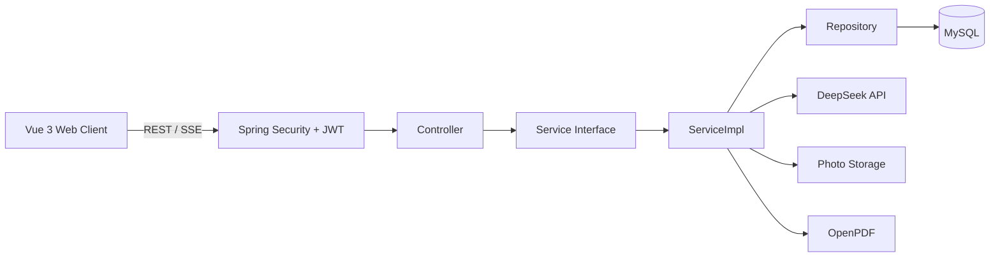
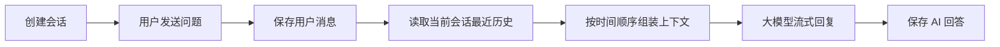
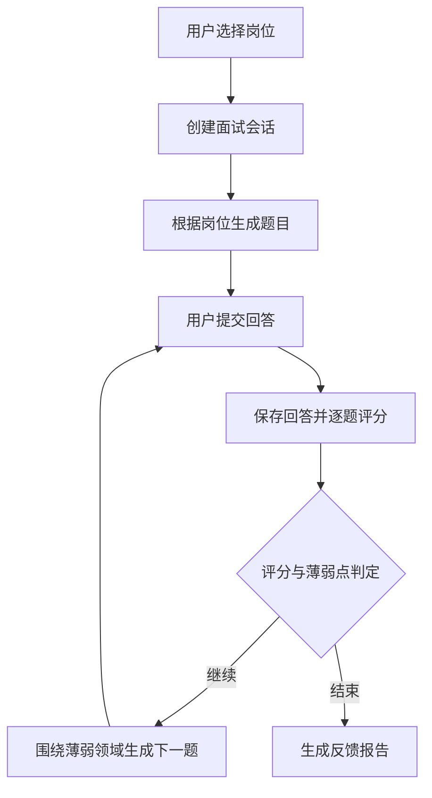
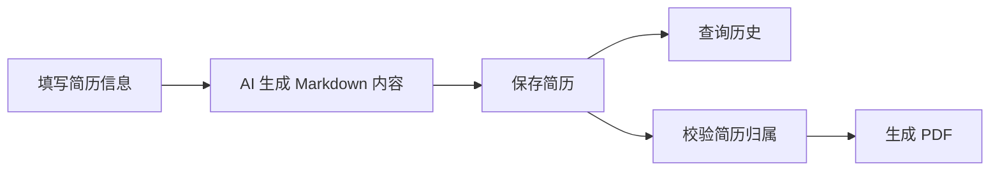

# Interview Assistant

## 项目简介

Interview Assistant 是面向计算机相关岗位的 AI 面试辅助系统。系统提供 AI 多轮对话、自适应模拟面试、简历生成、PDF 导出与历史记录查询能力。

项目采用前后端分离架构：前端使用 Vue 3，后端使用 Spring Boot 3，业务数据保存在 MySQL，大模型能力通过 DeepSeek Chat Completions API 提供。

## 核心功能

- 用户注册、登录、JWT 身份认证和资料维护。
- AI 会话创建、历史查询、流式回复和会话删除。
- 同一会话内携带最近的用户问题和 AI 回答，支持上下文记忆。
- 根据目标岗位创建模拟面试并生成题目。
- 保存用户回答，完成逐题评分和点评。
- 根据累计得分和薄弱类别决定继续追问或结束面试。
- 生成面试总分、总评、参考答案和学习反馈报告。
- 生成 Markdown 简历，查询简历历史并导出 PDF。
- 上传 JPG、PNG 或 WebP 格式的简历照片。

## 技术架构

| 层级 | 技术 |
| --- | --- |
| 前端 | Vue 3、Vite 5、Vue Router 4、Element Plus |
| HTTP | Axios、Fetch、SSE |
| 后端 | Java 17、Spring Boot 3.2.5、Spring MVC |
| 安全 | Spring Security、JWT、BCrypt |
| 数据访问 | Spring Data JPA、Hibernate |
| 数据库 | MySQL |
| AI | Spring WebClient、DeepSeek Chat Completions API |
| PDF | OpenPDF |
| 测试 | JUnit 5、Mockito、Spring Boot Test |



后端依赖方向：

```text
Controller -> Service -> ServiceImpl -> Repository -> Database
```

Controller 处理 HTTP/SSE 协议和请求校验，业务流程集中在 ServiceImpl，Repository 负责数据持久化。

## 业务流程

### AI 会话



默认携带最近 20 条消息，由 `CHAT_CONTEXT_MESSAGE_LIMIT` 控制。历史消息按 `conversationId` 隔离。

### 模拟面试



面试默认最多 5 题。完成至少 3 题后，当平均分不低于 85 且没有低于 60 分的答题时，面试可提前结束；否则继续考察当前最低分类别。

### 简历生成



## 模块职责

| 模块 | 核心类 | 职责 |
| --- | --- | --- |
| 认证 | `AuthController` / `AuthServiceImpl` | 注册、登录、JWT 签发 |
| 用户 | `UserController` / `UserServiceImpl` | 资料查询、邮箱和密码更新 |
| 会话 | `ChatController` / `ChatServiceImpl` | 会话管理、上下文组装、消息持久化和流式回复 |
| 面试 | `InterviewController` / `InterviewServiceImpl` | 岗位选题、回答保存、逐题评分、自适应决策和反馈报告 |
| 简历 | `ResumeController` / `ResumeServiceImpl` | 简历生成、历史查询、归属校验、照片持久化和 PDF 编排 |
| AI | `AIService` / `AIServiceImpl` | 普通和流式大模型请求、多轮消息转换 |
| 数据 | `repository` / `entity` | 用户、会话、消息、面试和简历数据持久化 |
| 安全 | `SecurityConfig` / `JwtAuthenticationFilter` | 路由权限、JWT 解析和认证上下文 |
| 通用 | `GlobalExceptionHandler` / `RequestIdFilter` | 统一异常响应和请求链路标识 |

## 核心接口

除认证接口外，业务接口需要请求头：

```http
Authorization: Bearer <token>
```

### 认证与用户

| 方法 | 路径 | 功能 |
| --- | --- | --- |
| `POST` | `/api/auth/register` | 注册 |
| `POST` | `/api/auth/login` | 登录 |
| `GET` | `/api/user/profile` | 获取当前用户资料 |
| `PUT` | `/api/user/profile` | 更新当前用户资料 |

### AI 会话

| 方法 | 路径 | 功能 |
| --- | --- | --- |
| `POST` | `/api/chat` | 发送消息并通过 SSE 接收回复 |
| `POST` | `/api/conversations` | 创建会话 |
| `GET` | `/api/conversations` | 查询会话列表 |
| `GET` | `/api/conversations/{id}/messages` | 查询会话消息 |
| `DELETE` | `/api/conversations/{id}` | 删除会话 |

会话 SSE 事件：`user_message`、`token`、`done`、`error`。

### 模拟面试

| 方法 | 路径 | 功能 |
| --- | --- | --- |
| `POST` | `/api/interview/start` | 创建面试并获取首题 |
| `POST` | `/api/interview/answer` | 提交回答并获取评分、决策或下一题 |
| `POST` | `/api/interview/terminate` | 主动终止面试 |
| `GET` | `/api/interview/sessions` | 查询面试历史 |
| `GET` | `/api/interview/sessions/{id}` | 查询面试详情 |

面试 SSE 事件：`greeting`、`session_created`、`question`、`answer_saved`、`interview_decision`、`evaluating`、`final_evaluation`、`terminated`、`error`。

### 简历

| 方法 | 路径 | 功能 |
| --- | --- | --- |
| `POST` | `/api/resume/generate` | 生成简历 |
| `GET` | `/api/resume/history` | 查询简历历史 |
| `GET` | `/api/resume/{id}/pdf` | 下载简历 PDF |
| `POST` | `/api/resume/upload-photo` | 上传简历照片 |

REST 接口使用统一响应结构：

```json
{
  "code": 200,
  "message": "success",
  "data": {}
}
```

## 可靠性设计

- JWT 无状态认证，密码使用 BCrypt 哈希保存。
- 会话、面试和简历在 ServiceImpl 中校验用户归属。
- `GlobalExceptionHandler` 统一处理参数、业务、限流和 AI 服务异常。
- 每个 HTTP 请求生成或透传 `X-Request-Id`，并写入日志 MDC。
- AI 请求具有超时控制、响应校验和异常转换。
- 聊天按用户统计每日提问次数，默认上限为 50 次。
- 聊天上下文限制最近消息数，避免请求体持续增长。
- 上传照片校验空内容、扩展名和规范化后的目标路径。
- CORS 来源、上传路径和文件大小通过环境配置控制。
- Actuator 暴露 `/actuator/health`、`/actuator/info` 和 `/actuator/metrics`。
- 开发环境使用 JPA `update`，生产环境使用 `validate`。

## 快速开始

### 环境要求

- JDK 17
- Node.js 18+
- MySQL 8+
- DeepSeek API Key

### 1. 初始化数据库

```cmd
cd backend\database
init-db.cmd
```

默认数据库名为 `interview_assistant`，默认用户名和密码均为 `root`。

### 2. 配置后端

根目录 `.env.example` 记录了全部后端环境变量。本地启动前配置：

```cmd
set DEEPSEEK_API_KEY=your_deepseek_api_key
```

| 变量 | 默认值 | 作用 |
| --- | --- | --- |
| `SERVER_PORT` | `8080` | 后端端口 |
| `SPRING_PROFILES_ACTIVE` | `dev` | Spring Profile |
| `DB_USERNAME` | `root` | 数据库用户名 |
| `DB_PASSWORD` | `root` | 数据库密码 |
| `JWT_SECRET` | 开发默认值 | JWT 签名密钥 |
| `DEEPSEEK_API_KEY` | 空 | 大模型 API Key |
| `DEEPSEEK_MODEL` | `deepseek-v4-pro` | 模型名 |
| `CHAT_CONTEXT_MESSAGE_LIMIT` | `20` | 会话上下文消息数 |
| `INTERVIEW_DEFAULT_QUESTION_COUNT` | `5` | 面试最大题数 |
| `UPLOAD_PATH` | `uploads` | 上传文件目录 |

### 3. 启动后端

```cmd
cd backend
mvn-local.cmd spring-boot:run
```

后端地址：`http://localhost:8080`

### 4. 启动前端

```cmd
cd frontend
npm ci
npm run dev
```

前端地址：`http://localhost:3000`

### 5. 运行检查

```cmd
cd backend
mvn-local.cmd test
```

```cmd
cd frontend
npm run build
```

健康检查地址：`http://localhost:8080/actuator/health`
