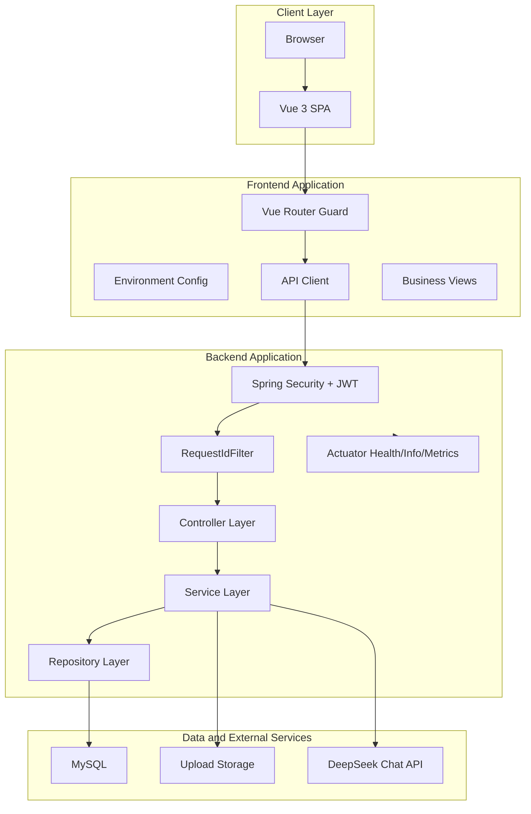

# Architecture Guide

本文档记录 Interview Assistant 当前的企业级工程架构改造结果，方便研发、测试、运维和后续架构演进共同使用。

## 架构原则

- 配置外置：环境差异通过环境变量和 `.env.example` 管理，不在源码中写死。
- 分层清晰：前端按配置、API、路由、页面分层；后端按 Controller、Service、Repository、Entity、Config 分层。
- 默认安全：除认证、上传静态资源和健康检查外，后端接口默认需要 JWT。
- 可观测：每个请求生成或透传 `X-Request-Id`，日志中写入 requestId，服务通过 Actuator 暴露健康检查。
- 渐进改造：保持当前业务功能不变，优先加固基础设施和协作规范。

## 当前逻辑架构



## 后端企业级改造

### 分层依赖规则

```text
Controller -> Service -> ServiceImpl -> Repository -> Database
                              |
                              +-> AI / PDF / File Storage
```

- `Controller`：只负责 HTTP/SSE 协议、参数校验和响应组装，不访问 Repository，不执行文件持久化或业务权限判断。
- `Service`：定义按业务场景命名的用例接口，作为 Controller 的唯一业务依赖。
- `ServiceImpl`：负责业务流程编排、归属权校验、实体/DTO 转换及调用 Repository 和基础能力。
- `Repository`：只负责实体持久化和查询，不承载业务流程。
- `Entity/DTO`：Entity 用于持久化，DTO 用于对外契约；Controller 不直接返回 Entity。

| 改造项 | 文件 | 价值 |
| --- | --- | --- |
| 强类型配置扫描 | `InterviewAssistantApplication.java` | 让配置项可集中建模、可校验、可生成元数据 |
| 配置属性类 | `config/properties/*Properties.java` | 避免到处散落 `@Value`，后续更容易测试和扩展 |
| Actuator | `pom.xml`、`application.yml` | 提供 `/actuator/health`、`/actuator/info`、`/actuator/metrics` |
| 请求追踪 | `common/RequestIdFilter.java` | 每个请求都有 `X-Request-Id`，方便日志检索和问题排查 |
| 安全白名单治理 | `config/SecurityConfig.java` | 明确开放认证、上传资源、健康检查，其余接口默认鉴权 |
| 编码和上传配置 | `application.yml` | 统一 UTF-8，限制上传文件大小 |
| 跨域配置治理 | `config/CorsConfig.java` | CORS 来源统一由 `app.cors.allowed-origin-patterns` 控制 |
| 上传资源映射治理 | `config/WebMvcConfig.java` | 上传目录统一由 `app.upload.path` 控制 |

## 前端企业级改造

| 改造项 | 文件 | 价值 |
| --- | --- | --- |
| 前端环境变量模板 | `frontend/.env.example` | 明确本地开发和部署时的前端配置 |
| API 基础路径配置 | `frontend/src/config/app.js` | 支持开发、测试、生产不同 API 地址 |
| Vite 代理环境化 | `frontend/vite.config.js` | 后端地址不再写死，方便多人协作和环境切换 |
| Axios 统一网关 | `frontend/src/api/request.js` | 统一鉴权、错误提示、登录过期处理 |
| SSE 请求整理 | `frontend/src/api/chat.js`、`frontend/src/api/interview.js` | 流式接口解析更清晰，错误信息可读 |

## 运行时入口

| 类型 | 地址 | 说明 |
| --- | --- | --- |
| 前端开发地址 | `http://localhost:3000` | Vite 开发服务器 |
| 后端业务地址 | `http://localhost:8080/api` | REST 和 SSE 接口 |
| 健康检查 | `http://localhost:8080/actuator/health` | 给负载均衡、容器探活、监控系统使用 |
| 上传资源 | `http://localhost:8080/uploads/**` | 本地上传文件访问路径 |

## 后续演进建议

- 将 `AIService` 抽象为 Provider 模式，支持 DeepSeek、OpenAI、私有模型网关等多模型切换。
- 引入 Flyway 或 Liquibase，替代生产环境手工 SQL 变更。
- 用 Redis 承载用户级限流、会话缓存和分布式锁。
- 增加统一审计日志，记录登录、简历生成、面试评分、会话删除等关键动作。
- 将上传文件迁移到对象存储，增加 MIME 类型校验、大小限制和内容安全扫描。
- 为前端增加 ESLint、Prettier、Vitest、Playwright，纳入 CI。
